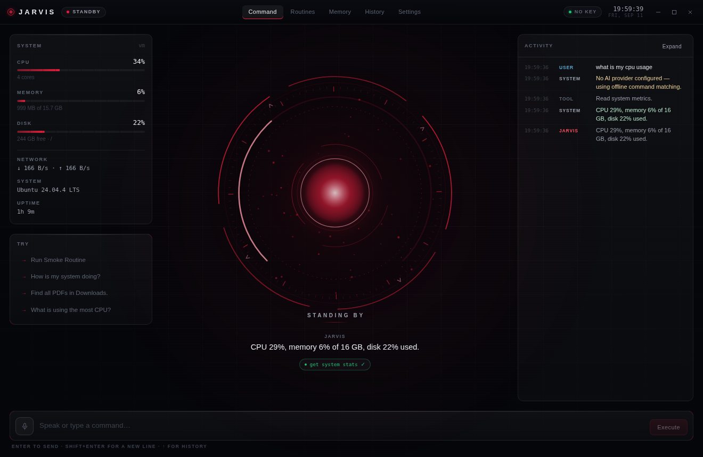
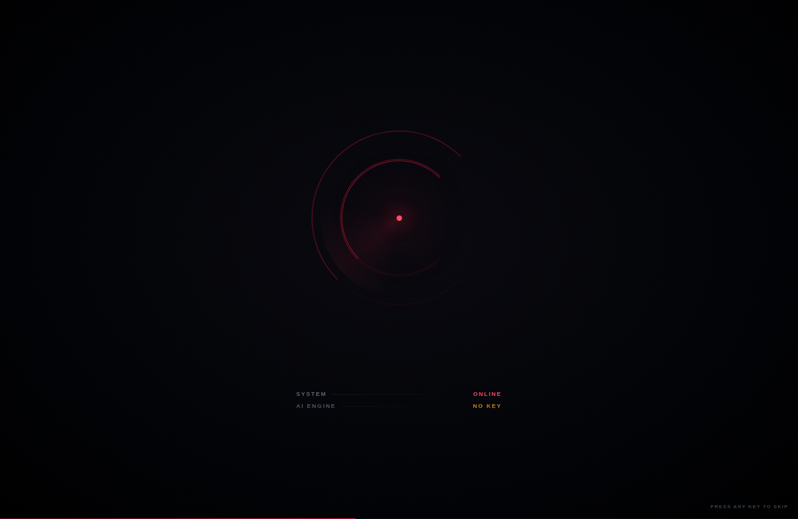
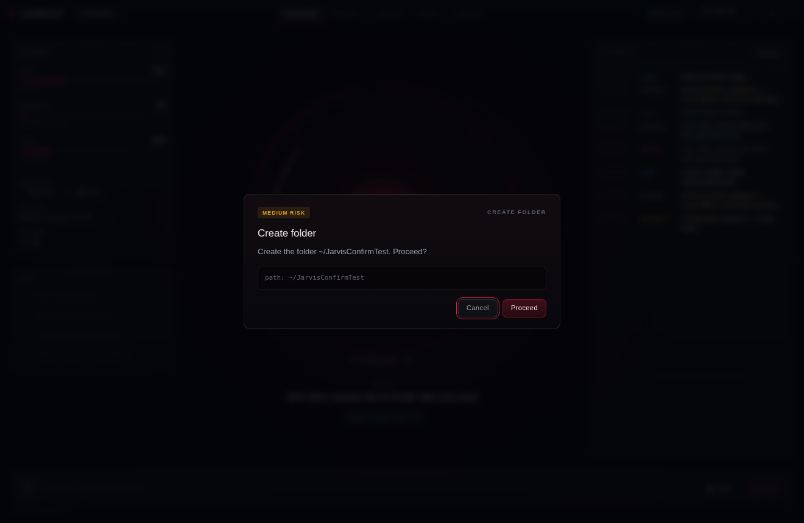
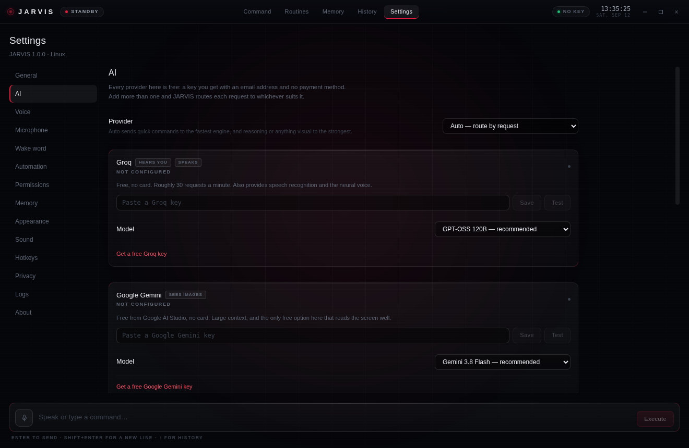
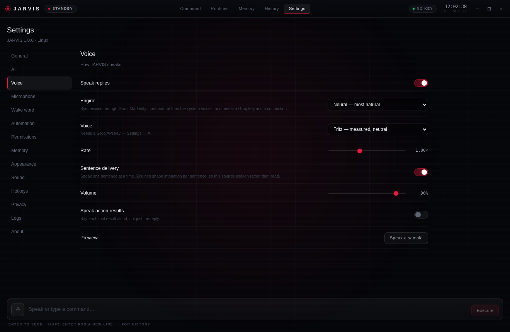
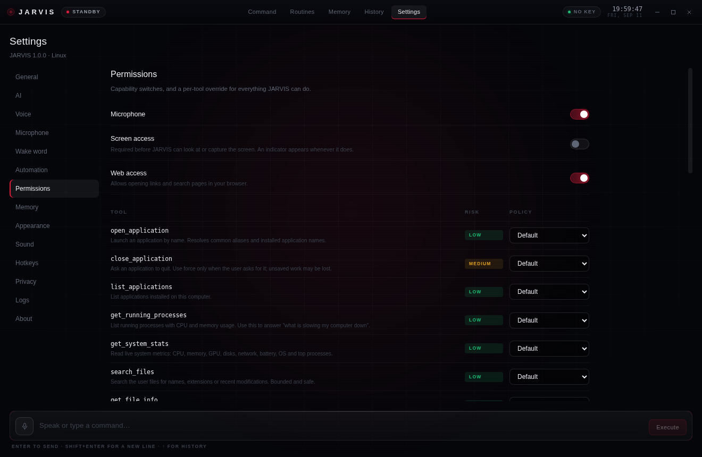

<div align="center">

# JARVIS

**Just A Really Very Intelligent System**

An intelligent layer that sits on top of your computer — understands natural language,
plans multi-step work, and carries it out through a fixed set of audited tools.

Windows 11 · macOS · Linux

</div>



---

## What it is

JARVIS is a desktop AI assistant, not a chat window. You speak or type a request;
it works out what you mean, decides which tools to use, asks before anything
consequential, performs the work on the actual operating system, and tells you
what happened.

```
"How is my system doing?"          → reads live CPU, memory, disk, battery
"Open my development environment"  → resolves your preferences, launches, reports
"Find the PDFs in Downloads"       → bounded filesystem search, ranked by date
"Clean up my desktop"              → shows the plan, waits for [EXECUTE]
"Delete these files"               → names every file, waits for confirmation
"Remember my browser is Firefox"   → stored, visible and removable in Memory
"Start work"                       → runs the routine you saved, offline
```

It never executes model-generated code. The model can only propose a call to one
of the tools listed in [Tools](#tools); a security layer validates the arguments
and decides whether it runs, needs confirmation, or is refused.

<table>
<tr>
<td width="50%"><br><sub><b>Startup</b> — diagnostics report what is actually true; no key means <code>NO KEY</code>, not <code>READY</code>.</sub></td>
<td width="50%"><br><sub><b>The gate</b> — nothing consequential happens without this, and Cancel holds focus.</sub></td>
</tr>
</table>

---

## The stack, and why

| Layer | Choice | Reason |
|---|---|---|
| Shell | **Electron** | Native tray/menu-bar, global shortcuts, screen capture and OS-encrypted credential storage all exist as first-class APIs on both Windows and macOS. Tauri would be leaner, but the automation layer — process enumeration, metrics, app discovery — is far more mature in Node, and a Rust toolchain is a real barrier for contributors on both platforms. |
| Language | **TypeScript**, strict everywhere | The main↔renderer contract is the security boundary; it should be checked by a compiler. |
| Interface | **React + Vite** | Fast HMR during development; the interface is state-driven, not document-driven. |
| Core visual | **Canvas 2D** | One animation loop, no DOM churn, no WebGL context to lose. Three.js would cost more than the design needs. |
| Audio | **Web Audio + MediaRecorder** | Real analyser data drives the core's waveform, rather than a decorative animation. |
| Models | **Free tiers only**, behind one provider interface | Groq, Google Gemini, OpenRouter and a local Ollama all speak the OpenAI chat API, so a provider is data — a URL, a key and a model list — not code. Adding one is a row in a table. |
| Speech in | **Groq Whisper** (`whisper-large-v3-turbo`) | Latency is what you feel in a voice assistant, and Groq is the fastest path from audio to text. |
| Speech out | **Groq neural TTS**, with OS voices as fallback | The operating system's voices are unmistakably synthetic. Neural audio also passes through an analyser on its way to the speakers, so the core's waveform is driven by real speech. |
| Metrics | **systeminformation** | One cross-platform API for CPU, memory, GPU, disks, network and battery. |
| Validation | **zod** | One schema per tool: runtime validation *and* the JSON Schema published to the model. |

---

## Architecture

```
                    Voice ─┐
                           ├──► Engine ──► AI provider (free tier, by role)
                    Text ──┘       │              │
                                   │              ▼
                                   │        structured tool call
                                   ▼              │
                            ┌──────────────────────────────┐
                            │      SECURITY LAYER          │
                            │  schema · paths · commands   │
                            │  risk · permissions · confirm│
                            └──────────────┬───────────────┘
                                           ▼
                              Platform abstraction (one interface)
                                  ┌────────┼────────┐
                              Windows    macOS     Linux
                                  └────────┼────────┘
                                           ▼
                                   Operating system
                                           │
                            result ────────┴──► Engine ──► voice + interface
```

Nothing above the platform layer knows which operating system it is running on.
`src/main/platform/index.ts` is the only place that branches on `process.platform`.

```
src/
  main/                    privileged process — holds every secret
    core/
      ai/                  one OpenAI-compatible provider, AUTO router by role
      engine.ts            request loop, tool calls, plans, routines
      permissions.ts       risk classification and the confirmation gate
      memory.ts            long-term preferences
      routines.ts          saved multi-step sequences
      intent.ts            offline command matching (works with no model)
    tools/
      descriptors.ts       the catalogue: schema + risk + description
      validate.ts          path, URL and command validation (pure, unit-tested)
      registry.ts          validate → execute → log
      filesystem · applications · system · web · screen · terminal · power
    platform/
      windows.ts · macos.ts · linux.ts · exec.ts (argument-array spawn)
    services/              monitoring, logging, secrets, settings, history, …
    windows/               window, tray, global hotkeys
  preload/                 the only bridge; a fixed list of channels
  renderer/                interface — never sees a key, never touches the OS
  shared/                  types, defaults, IPC names and the provider catalogue
tests/                     172 tests, security paths first
```

---

## Running it

```bash
npm install
cp .env.example .env      # add your keys, or configure them in Settings → AI
npm run dev               # development, with hot reload
npm run build && npm start
```

Packaging:

```bash
npm run dist:win          # NSIS installer, x64 + arm64
npm run dist:mac          # DMG, x64 + arm64
npm run dist:linux        # AppImage
```

Verification:

```bash
npm test                  # unit tests
npm run smoke             # launches the real app, drives it, captures screenshots
npm run typecheck
```

`npm run smoke` boots the application in a disposable data directory, runs the
tool layer against real files, confirms that traversal, shell injection and
dangerous URL schemes are refused, checks that the confirmation gate appears and
that approving it actually performs the action, and writes a screenshot of every
screen to `screenshots/`.

### If startup fails with `ERR_MODULE_NOT_FOUND`

`node_modules` is out of date — dependencies changed since your last install:

```bash
npm install
```

Every `dev`, `start` and `build` now checks this first and says so plainly
rather than letting Electron die in a dialog.

### If `npm run dev` says `Error: Electron uninstall`

`npm install` downloads the Electron binary from a postinstall script, which is
skipped when `ignore-scripts` is set and can fail quietly behind a proxy or
corporate firewall. electron-vite then reports the missing binary with that
rather unhelpful message.

Every `dev`, `start` and `build` run now checks for the binary first and fetches
it if it is missing, so this should repair itself. To do it by hand:

```bash
node node_modules/electron/install.js
```

Two different things cause it, and they need opposite fixes. The guard now
tells them apart and prints the matching advice.

**`Access is denied` / `os error 5` / `EPERM` — Windows refused the write.**
Usually Defender's Controlled Folder Access (which protects Documents, Desktop
and Pictures by default), OneDrive syncing the folder, or a stale `electron.exe`
holding a lock:

```powershell
taskkill /f /im electron.exe
Remove-Item -Recurse -Force node_modules\electron\dist
node node_modules\electron\install.js
```

If that does not do it, keep the project somewhere Windows neither protects nor
syncs — `C:\dev\JARVIS` rather than `C:\Users\you\Documents\JARVIS`.

**`ENOTFOUND` / `ETIMEDOUT` / certificate errors — the download was blocked.**

```bash
npm config set proxy http://your-proxy:port
npm config set https-proxy http://your-proxy:port

set ELECTRON_MIRROR=https://npmmirror.com/mirrors/electron/
node node_modules/electron/install.js
```

## Providers — all free

JARVIS uses no paid API. Every provider below gives you a key for an email
address with no payment method, or needs no key at all. Configure one or
several: with more than one, each request goes to whichever suits it, and a
provider that hits its daily cap falls back to the next.

| Provider | What it is for | The free tier, honestly |
|---|---|---|
| **Groq** | The fast path, plus **speech recognition and the neural voice** | ~30 requests a minute, no card. Start here — it is the only provider that also hears and speaks. [Get a key](https://console.groq.com/keys) |
| | | *Currently GPT-OSS 120B / 20B, Qwen3.8, Compound; Whisper for speech in, Orpheus for speech out.* |
| **Google Gemini** | Reasoning, planning and **reading your screen** | Free from AI Studio, no card, very large context. The only dependable free option that can see. [Get a key](https://aistudio.google.com/apikey) |
| **OpenRouter** | Variety and fallback | Genuinely free models, no card — but roughly 50 requests a day, which makes it a better backup than a main engine. [Get a key](https://openrouter.ai/keys) |
| **Ollama** | Everything local | No key, no account, no network, no limits. You supply the hardware. Detected automatically when it is running. [Install](https://ollama.com/download) |
| **Custom** | Anything else | Any other OpenAI-compatible server — self-hosted, a company gateway, or a provider not listed here. |



Adding a provider is a row in `src/shared/providers.ts`: a base URL, a key
name, a model list and a ranking per role. There is no per-provider code.

**Model lists are fetched, not assumed.** Providers retire models — Groq
withdrew the Llama 3.x models and PlayAI voices during 2026 — so a list written
into the source is a guess with an expiry date. JARVIS asks each configured
provider what it actually serves, populates the dropdown from that, and if your
selected model has been retired it falls back to a working one, says so, and
asks you to pick again. A deprecation becomes a corrected dropdown rather than
a failed request.

**Deliberately excluded:** services whose "free tier" needs a card. Cerebras,
for one, ended its no-card tier in August 2026 — you can still point the Custom
endpoint at it, but it is not presented here as free.

### How AUTO chooses

Each request is scored and given a role, and the best *available* provider for
that role wins:

- **fast** — short, obvious commands ("open Chrome", "volume 40"). Latency is
  what you notice, so Groq leads.
- **reasoning** — multi-step, ambiguous or consequential requests, and anything
  several tool calls deep. Gemini leads.
- **vision** — anything about what is on screen. Only providers whose selected
  model accepts images are eligible; if none is, JARVIS says so rather than
  guessing at a black rectangle.

**No keys?** JARVIS still runs. It falls back to offline command matching for
direct instructions ("open Chrome", "what's my CPU usage", "create a folder
called Projects"), and Demo Mode shows the entire interface with nothing
executed and everything clearly labelled.

---

## Voice

| Mode | How |
|---|---|
| Click to talk | The microphone button. Speak; it stops on silence. |
| Hold to talk | Hold `Ctrl/Cmd+Shift+Space` while the window has focus. |
| Global shortcut | `Ctrl+Space` (Windows) / `Cmd+Space` (macOS) from any application. |
| Wake word | Optional. Say "Hey JARVIS". |
| Text | Always available. |

The microphone is opened only while JARVIS is listening, and the title bar shows
`MIC OPEN` for exactly as long as it is. Wake-word detection works by watching
for speech locally and transcribing short clips to recognise the phrase — it is
off by default, and the indicator reads `WAKE` whenever it is armed.

Say "stop" — or press `Esc` — and JARVIS stops talking immediately.

### Making it sound like a voice rather than a synthesiser

Most of what makes text-to-speech sound robotic is what it is asked to read, so
JARVIS cleans the text before speaking it: paths become "report.pdf in
Downloads" instead of a string of slashes, `2.1 GB` becomes gigabytes, URLs
become their host, and markdown, arrows and emoji stop being read as
punctuation. Replies are then delivered a sentence at a time, because speech
engines shape intonation per utterance — three sentences as three utterances
sound spoken, the same text as one sounds recited.

Three engines, in descending order of how human they sound:

| Engine | Needs | Notes |
|---|---|---|
| **Neural** | A Groq key, and a connection | Clearly the best. Selected automatically on first run when a Groq key is present. Sentences are fetched one ahead, so long replies play without gaps. |
| **System** | Nothing | The OS voices. On Windows 11 pick one marked ★ — the "Natural" voices are far better than the legacy ones, and JARVIS ranks them first. |
| **Native** | Nothing | `say` / SAPI directly, for systems that expose no voice to Chromium. |



> On macOS, `Cmd+Space` belongs to Spotlight until you free it in System
> Settings → Keyboard → Shortcuts. JARVIS reports the clash rather than failing
> silently, and the shortcut is configurable.

---

## Security

The model proposes; it never disposes.

**Risk classification.** Every tool is low, medium or high risk. Low risk runs
automatically (opening an app, reading metrics). Medium risk confirms by default
(moving files, changing settings). High risk *always* confirms and cannot be
configured not to — deleting, running a command, restarting, shutting down.

**Path validation.** Model-supplied paths are expanded, resolved, and checked
against protected locations (system directories, credential stores, browser
profiles) and allowed roots before any filesystem call. Traversal, UNC paths,
Windows device names and NUL bytes are refused. Windows rules are evaluated with
Windows path semantics even when the checks run elsewhere.

**Command execution.** JARVIS never spawns a shell. Programs are launched with an
argument vector, so `;`, `&&`, backticks and `$(…)` inside a value are inert
data. The program itself must be on an allow-list, shell interpreters are
refused outright, and every call requires explicit confirmation. PowerShell and
AppleScript are driven by static scripts with dynamic values passed through
environment variables — never string-interpolated.

**Secrets.** API keys live in the main process only, in OS-encrypted storage
(`safeStorage`) or the environment. The renderer can set and clear a key but can
never read one back, and the log writer redacts anything key-shaped before it
reaches disk.

**Process isolation.** Context isolation on, node integration off, sandbox on,
a strict CSP, an explicit IPC channel list, and a permission handler that grants
the microphone to our own window and nothing else.

---

## Tools

| Category | Tools | Risk |
|---|---|---|
| Applications | `open_application` `close_application` `list_applications` | low – medium |
| Applications | `close_other_applications` | **high** |
| Files | `search_files` `get_file_info` `read_text_file` `open_path` | low – medium |
| | `find_large_files` `get_folder_size` | low |
| | `create_folder` `create_file` `move_file` `move_files` `copy_file` `rename_file` | medium |
| | `delete_file` `empty_trash` | **high** |
| System | `get_system_stats` `get_running_processes` `open_settings` `set_volume` | low – medium |
| Clipboard | `read_clipboard` `write_clipboard` | medium, opt-in |
| Web | `open_url` `web_search` | low |
| Screen | `take_screenshot` `read_screen` | medium, opt-in |
| Terminal | `execute_command` | **high** |
| Power | `lock_computer` `restart_computer` `shutdown_computer` | medium – **high**, opt-in |
| Memory | `remember` `forget` `recall` | low |
| Routines | `create_routine` `run_routine` `list_routines` `delete_routine` | low – medium |

Plus `present_plan`, which touches nothing: it declares what JARVIS intends to do
so you can see the plan — and approve it — before the first real action runs.

Every tool can be set to **always allow**, **always confirm** or **never** in
Settings → Permissions.



---

## Privacy

- Requests go to the free provider you configure (Groq, Gemini, OpenRouter, or a
  local Ollama that sends nothing anywhere) with the system
  metrics and tool results needed to answer them. Voice audio goes to Groq for
  transcription. Nothing else is transmitted.
- No telemetry, no analytics, no account.
- Memory, routines, history, settings and logs are plain JSON in your OS
  application-data directory, or wherever `JARVIS_DATA_DIR` points.
- Everything JARVIS remembers is listed on the Memory screen and can be deleted
  there, individually or all at once.

---

## Keyboard

| | |
|---|---|
| `Ctrl/Cmd + K` | Focus the command bar |
| `Ctrl/Cmd + 1…5` | Command · Routines · Memory · History · Settings |
| `Ctrl/Cmd + Shift + L` | Start listening |
| `Ctrl/Cmd + Shift + Space` | Hold to talk |
| `Enter` / `Shift + Enter` | Send / new line |
| `↑` `↓` | Command history |
| `Esc` | Stop speaking, cancel the request, or leave the current screen |

---

## Licence

MIT.
